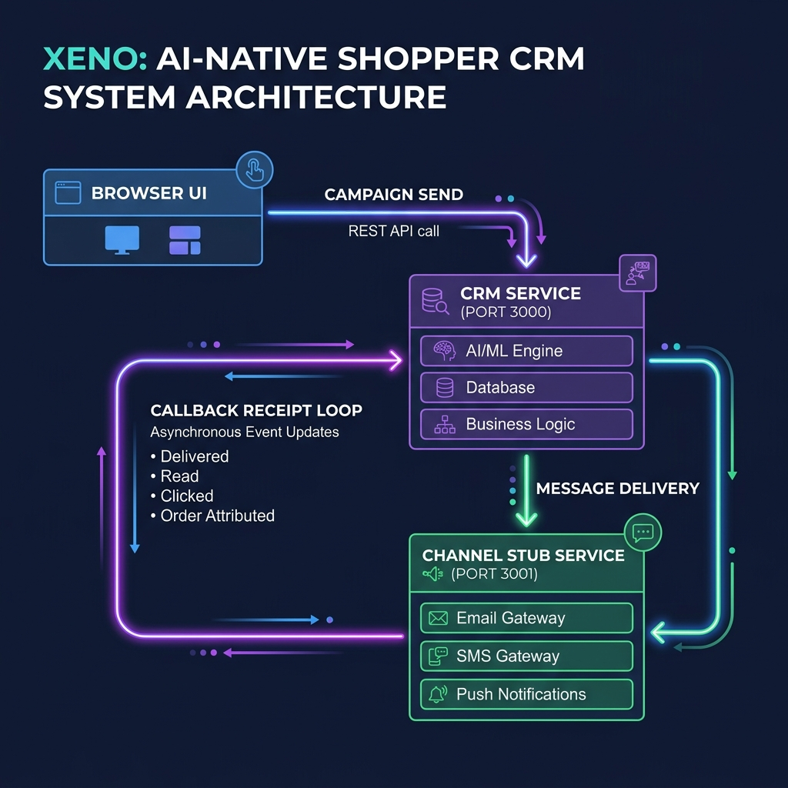
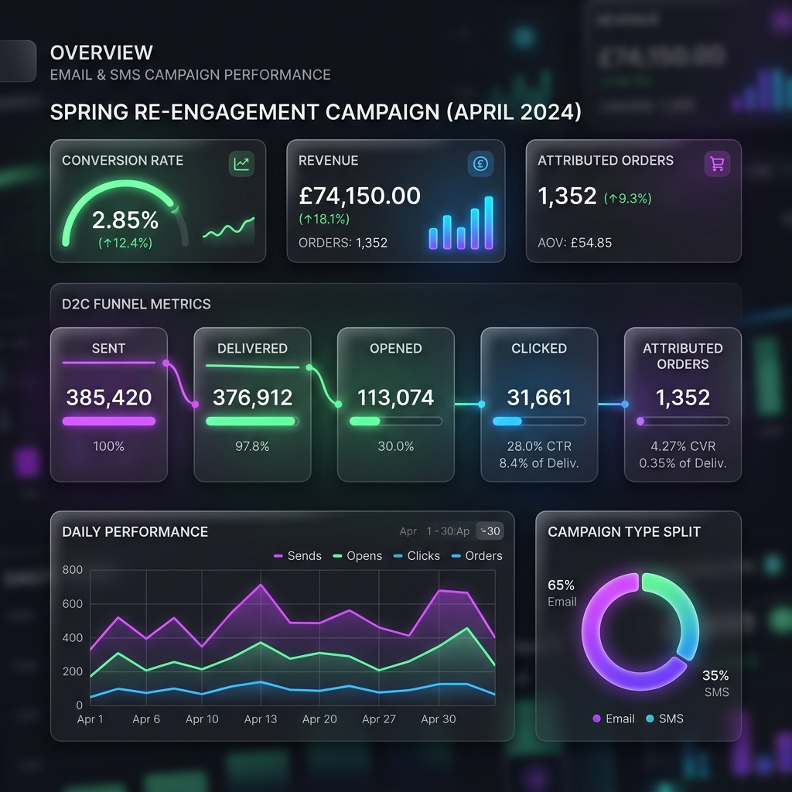

# Xeno Mini CRM

AI-native mini CRM for reaching shoppers. The product helps a D2C marketer ingest shopper data, ask an AI copilot for campaign strategy, create behavior-based audiences, send personalized communications, and track the full channel lifecycle through async callbacks.

GitHub one-line summary:

> AI-native shopper CRM that segments customers, drafts campaigns, sends through a stubbed channel service, and tracks async delivery/engagement receipts.

## 🎯 Quick Code Navigation for Recruiters

* 🛡️ **Idempotence & Status Ranking**: [lib/crm-app.js](file:///c:/Users/dell/Desktop/Xeno/lib/crm-app.js#L158-L205) — *Prevents duplicate event metrics and ensures out-of-order webhook callbacks cannot downgrade communication states.*
* 🗂️ **Behavioral Shopper Segmentation**: [lib/store.js](file:///c:/Users/dell/Desktop/Xeno/lib/store.js) — *Implements rules matching logic based on shopper spending, loyalty tier, geography, and preferred channels.*
* 🔌 **Developer Console & Channel Stub Service**: [lib/channel-app.js](file:///c:/Users/dell/Desktop/Xeno/lib/channel-app.js) & [lib/channel-console.html](file:///c:/Users/dell/Desktop/Xeno/lib/channel-console.html) — *Simulates real-world SMS/RCS/WhatsApp callback lifecycles and provides developer webhook simulator controls.*

## Run locally

```bash
npm start
```

Open `http://localhost:3000`.

`npm start` runs both services in one process for convenience:

- CRM app/API: `http://localhost:3000`
- Channel stub service: `http://localhost:3001`

You can also run them separately:

```bash
npm run start:channel
npm run start:crm
```

## API connection status

Yes, the APIs are connected.

- The frontend calls the CRM APIs using `fetch`.
- The CRM exposes `POST /api/campaigns/:id/send`.
- When a campaign is sent, the CRM calls the separate channel service at `POST http://localhost:3001/send`.
- The channel service simulates outcomes asynchronously.
- The channel service calls back into the CRM receipt API at `POST /api/receipts`.
- The CRM idempotently updates communication state and recomputes campaign metrics.

Health checks:

- `GET http://localhost:3000/api/health`
- `GET http://localhost:3001/health`

## Product point of view

I chose to build an AI-assisted campaign command center for a consumer brand marketer. The product focuses on the core Xeno loop:

- Ingest customer and order data.
- Decide who to talk to using behavior and attributes.
- Use AI to recommend an audience, channel, send window, and message.
- Send personalized communications.
- Track delivery and engagement through a callback-driven channel loop.

This is intentionally not a sales CRM. There are no pipelines, deals, tickets, or support workflows.

## Architecture



The application consists of a two-service, callback-driven event loop that closely mirrors production channel messaging architectures:

1. **Browser UI**: A premium, glassmorphic CRM command center that communicates with the CRM service via REST APIs.
2. **CRM Service (`port 3000`)**: Manages ingestion, behavior-based segmentation, campaign creation, and recomputes analytics on callback.
3. **Channel Stub Service (`port 3001`)**: Simulates messaging behaviors and asynchronously callbacks to the CRM to update states in real-time. Includes a visual developer console dashboard showing real-time logs, webhook simulators, and manual override event triggers.

## Performance Dashboard Mockup



## APIs

- `GET /api/state`: dashboard state, customers, segments, campaigns, communications, receipts.
- `GET /api/health`: CRM health check.
- `POST /api/customers`: ingest a customer.
- `POST /api/orders`: ingest an order.
- `POST /api/ai/draft`: generate an AI audience and campaign draft from a prompt.
- `POST /api/ai/chat`: chat with the campaign strategist AI.
- `POST /api/segments`: create a segment.
- `POST /api/campaigns`: create a campaign.
- `POST /api/campaigns/:id/send`: CRM send API.
- `POST /api/campaigns/:id/schedule`: schedule a draft campaign; the CRM sends it later through the same channel-service loop.
- `POST /api/receipts`: CRM receipt callback API.
- `POST /api/admin/reset`: reset demo data.
- `POST /api/auth/admin/login`: validate admin credentials, set session cookie.
- `POST /api/auth/customer/login`: validate customer email/phone, set session cookie.
- `POST /api/auth/logout`: destroy session and clear session cookie.
- `GET /api/auth/me`: retrieve active session status and role details.
- `GET /api/customer/profile`: retrieve authenticated customer's profile metrics.
- `GET /api/customer/orders`: retrieve authenticated customer's order history.
- `GET /api/customer/messages`: retrieve communications sent to the logged-in customer.
- `GET http://localhost:3001/health`: channel service health check.
- `POST http://localhost:3001/send`: channel service send endpoint.
- `POST http://localhost:3001/webhooks/whatsapp`: receive Meta Cloud API / Twilio status callbacks.

## Key files

- `server.js`: starts CRM and channel service together for local demo.
- `crm-server.js`: starts only the CRM service.
- `channel-server.js`: starts only the channel stub service.
- `lib/crm-app.js`: CRM API, receipt ingestion, campaign send logic.
- `lib/channel-app.js`: channel HTTP service.
- `lib/channel.js`: outcome simulation.
- `lib/store.js`: data model, seed data, segmentation, metrics.
- `lib/ai.js`: deterministic AI-style campaign planner.
- `lib/persistence.js`: JSON persistence.
- `lib/auth.js`: session manager for admin & customer credentials.
- `lib/whatsapp.js`: WhatsApp client abstraction for Meta Cloud API & Twilio.
- `public/login.html`: premium admin login dashboard.
- `public/customer-login.html`: clean login interface for customers.
- `public/customer-portal.html`: customer profile, orders, and messages overview.
- `public/`: dashboard UI.
- `tests/run-tests.js`: focused behavior tests.

## Improvements already added

- Split CRM and channel into separate services.
- Added persistent JSON storage in `data/crm-state.json`.
- Added health checks.
- Added channel retries.
- Added duplicate receipt simulation.
- Added out-of-order receipt simulation.
- Added idempotent receipt handling.
- Added status ranking so older events do not downgrade communication state.
- Added focused tests for AI draft, segmentation, metrics, idempotency, and out-of-order receipts.
- Added campaign scheduling with persisted scheduled state and timer rehydration on startup.
- Added richer segmentation with `all`/`any` combinators, spend, city, lifecycle, loyalty tier, category, and channel filters.
- Added AI chat mode plus optional LLM-backed campaign drafting.
- Added campaign attribution panel for campaign-driven revenue.
- Added polished the UI to feel more elegant, professional, and demo-ready.
- Added Admin/Owner session-based authentication to protect dashboard UI and CRM API endpoints.
- Added Customer Login portal and separate customer-facing dashboard for order history, profile details, and campaign delivery tracking.
- Added Real WhatsApp message sending support using Meta Cloud API and Twilio, with robust webhook status tracking.

## ⚙️ System Design & Scaling Tradeoffs

For the prototype take-home scope, conscious architectural tradeoffs were made to balance local ease-of-use with robust logic. Below is the blueprint of how this system scales to millions of users:

### 1. Data Layer & Persistence
* **Prototype**: In-memory JavaScript structures persisted to local JSON files (`data/crm-state.json`, `data/whatsapp-config.json`).
* **Production Scale**: 
  - **shopper & Order Data**: PostgreSQL or MongoDB with read-replicas for fast segment querying.
  - **Receipt Events Stream**: Partitioned event stores like **Apache Kafka** or **AWS Kinesis** to handle high-throughput callback receipt logging.

### 2. Message Dispatch & Queue Management
* **Prototype**: Synchronous REST calls (`/send`) triggering simulated event loops via `setTimeout` queues.
* **Production Scale**: 
  - Campaign dispatches are pushed to a distributed job queue system (like **BullMQ** on Redis or **Celery**). 
  - Workers pull segments, perform template rendering, and throttled-dispatch outbound messages to prevent hitting provider rate-limits.

### 3. Idempotency & Callback Verification
* **Prototype**: Simple in-memory tracking via Javascript `Set`.
* **Production Scale**: 
  - Unique idempotency keys mapped to event hashes in Redis (with TTL) to prevent duplicate processing of redundant webhooks.
  - **Webhook signature validation**: Meta/Twilio request verification keys validated using SHA256 HMAC headers to ensure webhook origin authenticity.

### 4. AI Strategy Planner
* **Prototype**: Deterministic local fallback generator with optional OpenAI chat-completion API connection.
* **Production Scale**: Integrated with LLM routers (like LangChain/LlamaIndex) querying vector databases (RAG) containing historical brand campaign performance data for highly optimized targeting.

Optional AI environment variables:

```bash
OPENAI_API_KEY=your_key
OPENAI_BASE_URL=https://api.openai.com/v1
LLM_MODEL=gpt-4o-mini
```

## Authentication & Portals

### Admin / Owner Login
- The main desk at `http://localhost:3000` is now protected by a secure login page.
- Default Admin Credentials:
  - **Email**: `admin@xeno.io`
  - **Password**: `admin123`
- Credentials can be customized via environment variables: `ADMIN_EMAIL` and `ADMIN_PASSWORD`.
- Session tokens are generated on successful validation and stored in-memory using HttpOnly cookies to restrict access to the CRM APIs.

### Customer Portal
- Customers can log into their personal portal at `http://localhost:3000/customer-login.html`.
- Authentication requires matching both a registered customer's **Email** and **Phone** (no passwords required).
- Inside the Customer Portal, customers can:
  - View their profile attributes (loyalty tier, preferred channel, city, opt-in status).
  - Track their total spend, average order value, and order history.
  - Review all campaigns sent to them along with real-time delivery statuses (sent, delivered, read, clicked, failed).

---

## WhatsApp Integration

The platform now supports sending real WhatsApp messages using either the **Meta Cloud API** or **Twilio** with a fallback to the simulated channel service.

### Meta Cloud API Configuration
Configure the following environment variables:
```bash
WHATSAPP_PROVIDER=meta
WHATSAPP_PHONE_ID=your_phone_number_id
WHATSAPP_ACCESS_TOKEN=your_permanent_or_temporary_access_token
WHATSAPP_VERIFY_TOKEN=xeno_verify # Token used for webhook verification
```

### Twilio Configuration
Configure the following environment variables:
```bash
WHATSAPP_PROVIDER=twilio
TWILIO_ACCOUNT_SID=your_account_sid
TWILIO_AUTH_TOKEN=your_auth_token
TWILIO_WHATSAPP_FROM=your_twilio_whatsapp_number # e.g. +14155238886
```

### Webhook Status Callback
- Expose the channel service webhook endpoint: `POST http://<your-domain>/webhooks/whatsapp`.
- Incoming status reports (e.g., delivered, read, failed) from Meta or Twilio are parsed, mapped to CRM status types, and forwarded to the CRM callback endpoint to update campaign performance in real-time.

## Tests

```bash
npm test
```

Current coverage checks AI draft generation, segment matching, campaign metrics, receipt idempotency, out-of-order receipts, compound segmentation, and scheduling.

## Demo flow

1. Open `http://localhost:3000`.
2. Generate an AI draft from the default prompt.
3. Create the campaign.
4. Either send immediately or schedule it for 30 seconds.
5. Open the Receipt Loop tab and watch callbacks update recipient state.
6. Open Campaigns and review sent, delivered, opened, read, clicked, failed, and attributed revenue.
7. Open AI Chat and ask for campaign strategy in natural language.

## Deployment note

Render, Railway, or Fly.io are good fits for this project. For the simplest hosted demo, deploy `npm start` and expose the CRM port. For a more production-like deployment, run the CRM and channel service as separate processes with `CHANNEL_URL` and `CRM_URL` environment variables.

Suggested Render setup:

- Build command: `npm install`
- Start command: `npm start`
- Environment variables, optional: `OPENAI_API_KEY`, `OPENAI_BASE_URL`, `LLM_MODEL`
- Expose web service port from `PORT`
- Keep `CHANNEL_PORT` set to `3001` for the local channel stub inside the same service

## Submission checklist

- Working product: complete locally; deploy to Render/Railway/Fly for public URL.
- Code repository: push this repo to GitHub.
- Walkthrough video: record 5-6 minutes using the script below.
- AI-native story: show Command Center, AI Chat, optional LLM env vars, and explain offline fallback.
- System design story: show CRM service, channel service, callback receipt API, retries, idempotency, out-of-order handling, and persistence.

## Walkthrough video script

Product intro, 30 seconds:
I built an AI-native shopper CRM for a D2C brand called Loom & Lane. The product focuses on the Xeno loop: ingest shopper data, decide who to talk to, generate the right campaign, send through messaging channels, and track performance through delivery and engagement receipts.

Functional demo, 90 seconds:
Start in Command Center. Generate an AI draft from the default prompt. Show the suggested segment, channel, message, send window, and audience size. Create the campaign, then either send it or schedule it for 30 seconds. Open Receipt Loop and show callbacks arriving. Open Campaigns and show sent, delivered, opened, read, clicked, failed, and attributed revenue. Open AI Chat and ask a strategy question.

Architecture, 60 seconds:
The browser calls the CRM API. The CRM owns customers, orders, segments, campaigns, communications, and receipts. When a campaign is sent, the CRM calls a separate channel service over HTTP. The channel service simulates lifecycle events and asynchronously calls back into the CRM receipt API. Receipts are idempotent and status updates are ranked so out-of-order events cannot downgrade state.

Code walkthrough, 60 seconds:
Show `lib/crm-app.js` for APIs and receipt ingestion, `lib/channel-app.js` and `lib/channel.js` for the channel stub, `lib/store.js` for segmentation and metrics, `lib/ai.js` for LLM-first/offline AI planning, and `public/app.js` for the UI workflow.

AI-native workflow, 60 seconds:
Explain that AI is woven into the product through campaign drafting and chat-first strategy. The app can use a real OpenAI-compatible API when `OPENAI_API_KEY` is present, but falls back to a deterministic local planner so the demo remains reliable. Also mention using AI during development to scope, review, and harden the system.

Tradeoffs, 30 seconds:
For this take-home I used JSON persistence and local services to keep the project easy to run. At production scale I would use Postgres or MongoDB, queue campaign sends, deploy channel workers separately, and aggregate metrics from an event stream.
