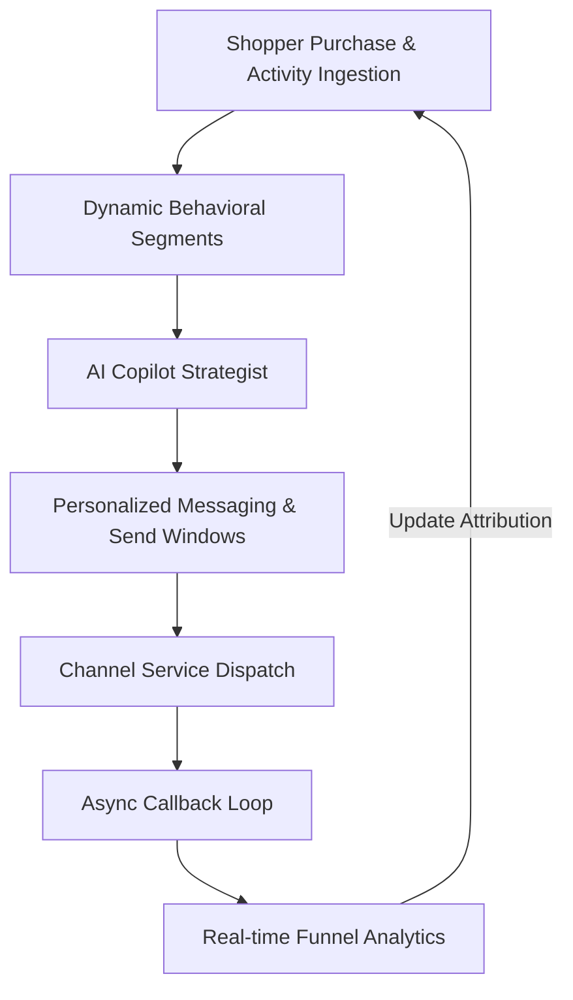
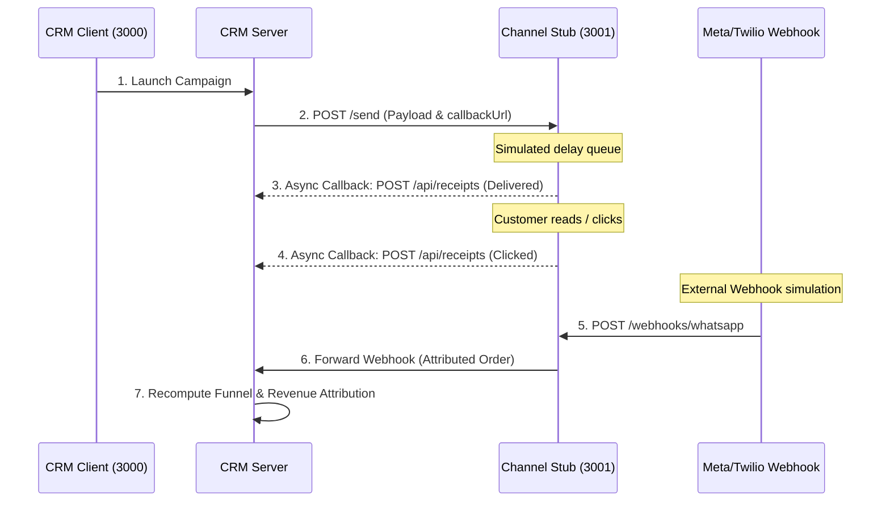
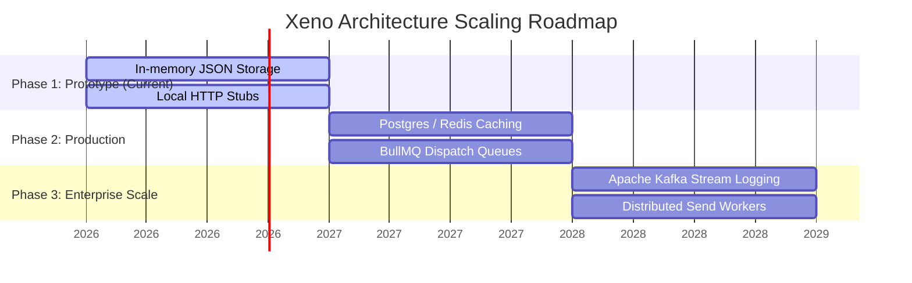

# Xeno Mini CRM
### *AI-Native Shopper Engagement Platform*

[](https://github.com/)
[](https://github.com/)
[](https://github.com/)
[](https://github.com/)

---

## 🎯 Quick Code Navigation for Recruiters & Reviewers

If you are evaluating the codebase's technical rigor, here are direct links to the core system designs:

* 🛡️ **Idempotent Callback Receipt Handling**: [lib/crm-app.js](file:///c:/Users/dell/Desktop/Xeno/lib/crm-app.js#L158-L205) — *Maintains a strict status-ranking order so older or duplicate webhook callbacks never downgrade communication states.*
* 🗂️ **Shopper Segmentation Rule Engine**: [lib/store.js](file:///c:/Users/dell/Desktop/Xeno/lib/store.js) — *Evaluates behavioral queries (spend tiers, regional filters, and channel preferences) over historical customer/order logs.*
* 🔌 **Developer console & Callback Stub**: [lib/channel-app.js](file:///c:/Users/dell/Desktop/Xeno/lib/channel-app.js) & [lib/channel-console.html](file:///c:/Users/dell/Desktop/Xeno/lib/channel-console.html) — *An independent service simulating real-world messaging callback delivery (delivered, read, clicked, ordered) with webhook simulators.*
* 🔑 **WhatsApp config persistence**: [lib/whatsapp.js](file:///c:/Users/dell/Desktop/Xeno/lib/whatsapp.js) — *Saves Twilio/Meta provider settings dynamically to a persistent configuration file.*

---

## 🚀 Hero & Platform Overview

Xeno Mini CRM is a high-performance, AI-native shopper engagement console designed to help consumer brands intelligently target, engage, and convert shoppers. By integrating semantic campaign planning with callback-driven lifecycle tracking, Xeno acts as an automated command desk for Direct-to-Consumer (D2C) marketing.


---

## ⚠️ The Problem Statement

Traditional CRM platforms are built as passive databases—static logs of customer lists where marketers manually craft rules, copy-paste messaging, and struggle to link callback events back to revenue.
* **Passive lists**: Audience segments become stale the minute they are compiled.
* **Disconnected Loops**: Delivery events (delivered, read, clicked) are rarely integrated back into segmentation filters or linked directly to orders.
* **Integration Overhead**: Real messaging channels like WhatsApp or SMS require complex webhooks that often fail, send duplicate events, or arrive out of order, corrupting CRM metrics.

---

## 💡 The Solution: AI-Native Engagement Loop

Xeno solves this by introducing a closed-loop, event-driven engagement system:



---

## 🧠 AI-Native Design

Xeno integrates AI deeply into the marketer's daily workflow rather than bolting it on as an afterthought:

* **Natural Language Copilot**: Describes marketing intent (e.g. *"Re-engage lapsed VIPs in Mumbai with a discount"*) and compiles SQL-like targeting rules, messages, and optimal send windows.
* **Context-Aware Customer Assistant**: Customers can log into their portal and interact with a personalized shopping assistant that suggests trending items and handles order status updates.
* **Hybrid Execution Engine**: Supports a deterministic offline parser for reliability, which automatically promotes to LLM generation (using OpenAI-compatible endpoints) when API keys are available.

---

## ⚙️ System Architecture

Xeno implements a robust microservices architecture separating CRM storage and UI rendering from dispatch simulation.


### Core Components
1. **Browser UI**: A glassmorphic dashboard featuring visual sparklines, live preview mockups, and campaign radar charts.
2. **CRM Service (`port 3000`)**: Governs ingestion pipelines, segment evaluations, campaign schedulers, and metrics aggregation.
3. **Channel Stub Service (`port 3001`)**: A simulator mimicking real-world messaging callback structures (Meta Cloud API and Twilio) with manual event trigger dashboards.

---

## 🔄 Campaign & Webhook Callback Lifecycle

Every message sent through Xeno goes through a callback lifecycle, ensuring high-fidelity delivery and attribution reporting:



---

## 🛡️ Engineering Challenges Solved

### 1. Idempotence & Deduplication
To prevent duplicate webhook status updates from distorting analytics, the CRM receipt controller implements a strict idempotency filter:
```javascript
if (!receipt.id || state.seenReceiptIds.has(receipt.id)) {
  return { duplicate: true };
}
```

### 2. Status Ranking & Out-of-Order Callbacks
Because network delivery reports can arrive out of order (e.g., a "read" status arrives before a "delivered" status), Xeno assigns strict priority weights to statuses. A status cannot be downgraded if a higher-ranking status has already been recorded:
```javascript
const rank = { queued: 0, sent: 1, failed: 2, delivered: 3, opened: 4, read: 5, clicked: 6 };
if (rank[receipt.type] >= rank[communication.status]) {
  communication.status = receipt.type;
  communication.deliveryState = receipt.type;
}
```

### 3. Automatic Timer Rehydration
Campaigns scheduled for future dispatches are stored with a target date. On server restarts, Xeno automatically scans the database and re-registers setTimeout hooks to prevent missed runs.

---

## 📈 Scalability Roadmap

The progression from local prototype to distributed, multi-region enterprise platform:



---

## 🛠️ Tech Stack & Key Choices

* **Frontend**: Pure Vanilla HTML5 & Javascript with standard CSS Custom Properties for maximum performance and zero dependency overhead.
* **Backend**: Node.js HTTP/FS module with minimal dependencies to ensure absolute transparency and rapid execution loops.
* **Database**: Lightweight JSON persistence layer for easy local evaluation.
* **WhatsApp Gateway**: Multi-provider abstractions supporting Meta Cloud API and Twilio with seamless configuration UI.

---

## 🚀 Future Vision
* **Real-time WebSockets**: Replacing the periodic polling system with full-duplex WebSockets to stream receipts instantly.
* **Signature Verification**: Validating Twilio/Meta SHA256 HMAC headers to secure callback routes.
* **Federated AI Agents**: Multi-agent setups where autonomous nodes write copy, monitor conversion funnels, and adjust campaigns dynamically.
